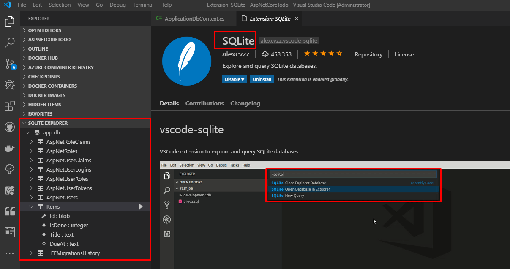

## Crear una migración

Las migraciones hacen un seguimiento de los cambios en la estructura de la base de datos a lo largo del tiempo. Permiten deshacer (revertir) un conjunto de cambios o crear una segunda base de datos con la misma estructura que la primera. Con las migraciones, tiene un historial completo de modificaciones, como agregar o eliminar columnas (y tablas completas).

En el capítulo anterior, agregaste un conjunto de `Tareas` al contexto. Dado que el contexto ahora incluye un conjunto (o tabla) que no existe en la base de datos, debe crear una migración para actualizar la base de datos:

```
dotnet ef migrations add AddItems
```

Esto crea una nueva migración llamada `AddItems` al examinar cualquier cambio que hayas realizado en el contexto.

> Si recibe un error como `No se ha encontrado el ejecutable que coincida con el comando" dotnet-ef "`, asegúrese de estar en el directorio correcto. Estos comandos deben ejecutarse desde el directorio raíz del proyecto (donde se encuentra el archivo `Program.cs`).

Si abres el directorio `Data/Migrations`, verás algunos archivos:


El primer archivo de migración (con un nombre como `00_CreateIdentitySchema.cs`) se creó y se aplicó hace mucho cuando ejecutó `dotnet new`. La nueva migración de `AddItem` tiene el prefijo de una marca de tiempo cuando la creas.

> Puede ver una lista de migraciones con `dotnet ef migrations list`.

Si abre su archivo de migración, verá dos métodos llamados `Up` y `Down`:

**Data/Migrations/<date>_AddItems.cs**

```csharp
protected override void Up(MigrationBuilder migrationBuilder)
{
    // (... some code)

    migrationBuilder.CreateTable(
        name: "Items",
        columns: table => new
        {
            Id = table.Column<Guid>(nullable: false),
            DueAt = table.Column<DateTimeOffset>(nullable: true),
            IsDone = table.Column<bool>(nullable: false),
            Title = table.Column<string>(nullable: true)
        },
        constraints: table =>
        {
            table.PrimaryKey("PK_Items", x => x.Id);
        });

    // (some code...)
}

protected override void Down(MigrationBuilder migrationBuilder)
{
    // (... some code)

    migrationBuilder.DropTable(
        name: "Items");

    // (some code...)
}
```

El método `Up` se ejecuta cuando aplica la migración a la base de datos. Dado que agregó un `DbSet<TodoItem>` al contexto de la base de datos, Entity Framework Core creará una tabla `Items` (con columnas que coinciden con un `TodoItem`) cuando aplique la migración.

El método `Down` hace lo contrario: si necesita deshacer (roll back) la migración, la tabla `Elementos` se eliminará.

### Revertir una migración

En caso de requerir revertir la acción de migración, pues ha detectado fallos o considera que necesita hacer ajustes antes de enviar a la base la migración bastará con ejecutar

```bash
dotnet ef migrations remove
```

para revertir la acción de migración, la cual también eliminará el archivo correspondiente sobre el directorio `Data/Migrations`.

### Solución para las limitaciones de SQLite

Existen algunas limitaciones de SQLite que se interponen si intenta ejecutar la migración como está. Hasta que se solucione este problema, use esta solución:

* Comente o elimine las líneas `migrationBuilder.AddForeignKey` en el método `Up`.
* Comente o elimine cualquier línea `migrationBuilder.DropForeignKey` en el método `Down`.

Si usa una base de datos SQL completa, como SQL Server o MySQL, esto no será un problema y no tendrá que hacer esta solución (la cual es ciertamente hacker).

### Exportación de Scripts de migración con EF (Mejora - Opcional)

// TODO: Esto es una version de mejora de este capitulo
sería aconsejable manejar una nomeclatura estandar para el nombre de los scripts, si bien EF ya controla el versionamiento en la ejecución de los mismos, supongamos que queramos replicar la misma base para un proyecto diferente. Sería claramente mas fácil, buscar y ejecutar los scripts de migración que fueron empleados en el orden correcto.

Claramente la exportación del Script será posible cuando los cambios sean detectados (aplicados con `dotnet ef migrations add <nombre_migracion>`), y antes de actualizar la base (`database update`)

Entonces crearemos un Script que respalda la migración `AddItems`. Desde una consola se usaría:

```bash
dotnet ef migrations script -o ..\ScriptsDB\AddItems.sql
```
Si todo sale bien verás algo como esto en la salida de consola:
```
$zenbook>AspNetCoreTodo\AspNetCoreTodo>dotnet ef migrations script -o ..\ScriptsDB\1.AddItems.sql
info: Microsoft.EntityFrameworkCore.Infrastructure[10403]
      Entity Framework Core 2.2.6-servicing-10079 initialized 'ApplicationDbContext' using provider 'Microsoft.EntityFrameworkCore.Sqlite' with options: None
```
y ademas, la nueva estructura del directorio raíz.
> AspNetCoreTodo
├── AspNetCoreTodo
├── **ScriptsDB**
│   └── **1.AddItems.sql**
└── README.md
> **Nota:**
Regularmente, empleo una carpeta **..\ScriptsDB**, en el directorio raíz de la solución para ir almacenando los scripts. Puedes usar la ruta de tu preferencia.

y la estructura del directorio `Data/Migrations`, será algo como:
>**AspNetCoreTodo\Data**
├── **Migrations**
│   ├── 00000000000000_CreateIdentitySchema.cs
│   ├── 00000000000000_CreateIdentitySchema.Designer.cs
│   ├── **20190920143051_AddItems.cs**
│   ├── 20190920143051_AddItems.Designer.cs
│   └── ApplicationDbContextModelSnapshot.cs
└── ApplicationDbContext.cs

### Aplicar la migración

El último paso después de crear una (o más) migraciones es aplicarlas realmente a la base de datos:

```bash
dotnet ef database update
```

Este comando hará que Entity Framework Core cree la tabla `Items` en la base de datos.

> Si desea revertir la base de datos, puede proporcionar el nombre de la migración *anterior*:
> `dotnet ef database update CreateIdentitySchema`
> Esto ejecutará los métodos `Down` de cualquier migración más reciente que la migración que especifique.

> Si necesita borrar por completo la base de datos y comenzar de nuevo, ejecute `dotnet ef database database` seguido de `dotnet ef database update` para volver a armar la base de datos y llevarla a la migración actual.

> **TRICK!!!** 
> Si tienes curiosidad por ver la base y los cambios efectuados, puede usar un administrador de base de datos de tu preferencia.
Pero si usas **VSCODE**, la Extensión `SQLite` vendrá de lujo para trabajar. 


¡Eso es! Tanto la base de datos como el contexto están listos para funcionar. A continuación, utilizará el contexto en su capa de servicio.