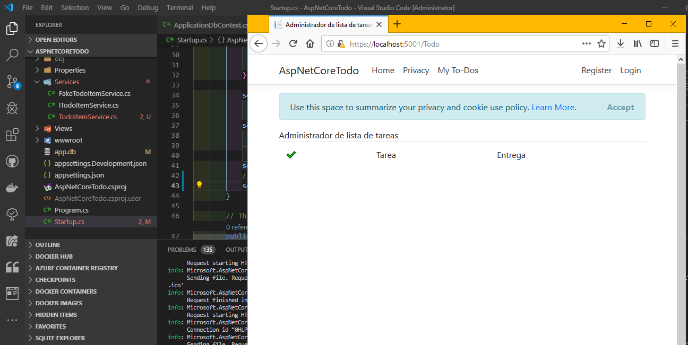

## Crear una nueva clase de servicio

Anteriormente en el capítulo de **conceptos básicos de MVC**, creaste un `FakeTodoItemService` que contenía elementos de tareas pendientes codificados. Ahora que tiene un contexto de base de datos, puede crear una nueva clase de servicio que usará Entity Framework Core para obtener los tareas reales de la base de datos.

Elimine el archivo `FakeTodoItemService.cs` y cree un nuevo archivo:

**Services/TodoItemService.cs**

```csharp
using System;
using System.Collections.Generic;
using System.Linq;
using System.Threading.Tasks;
using AspNetCoreTodo.Data;
using AspNetCoreTodo.Models;
using Microsoft.EntityFrameworkCore;

namespace AspNetCoreTodo.Services
{
    public class TodoItemService : ITodoItemService
    {
        private readonly ApplicationDbContext _context;

        public TodoItemService(ApplicationDbContext context)
        {
            _context = context;
        }

        public async Task<TodoItem[]> GetIncompleteItemsAsync()
        {
            var items = await _context.Items
                .Where(x => x.IsDone == false)
                .ToArrayAsync();
            return items;
        }
    }
}
```

Notará el mismo patrón de inyección de dependencia aquí que vio en el capítulo *Fundamentos de MVC*, excepto que esta vez se está inyectando el `ApplicationDbContext`. El `ApplicationDbContext` ya se está agregando al contenedor de servicios en el método `ConfigureServices`, por lo que está disponible para inyección aquí.

Echemos un vistazo más de cerca al código del método `GetIncompleteItemsAsync`. Primero, usa la propiedad `Items` del contexto para acceder a todos los elementos de la tarea en el `DbSet`:

```csharp
var items = await _context.Items
```

Luego, el método `Where` se usa para filtrar solo las tareas que no están completas:

```csharp
.Where(x => x.IsDone == false)
```

El método `Where` es una característica de C # llamada LINQ (**L**enguaje **IN**tegrated **Q**uery), que se inspira en la programación funcional y facilita la expresión de consultas de base de datos en código. Bajo el capó, Entity Framework Core traduce el método `Where` en una declaración como `SELECT * FROM Items WHERE IsDone = 0`, o un documento de consulta equivalente en una base de datos NoSQL.

Finalmente, el método `ToArrayAsync` le dice a Entity Framework Core que obtenga todas las entidades que coincidan con el filtro y las devuelva como una matriz. El método `ToArrayAsync` es asíncrono (devuelve un `Task`), por lo que debe estar esperando `await` para obtener su valor.

Para que el método sea un poco más corto, puedes eliminar la variable intermedia `items` y simplemente devolver el resultado de la consulta directamente (que hace lo mismo):

```csharp
public async Task<TodoItem[]> GetIncompleteItemsAsync()
{
    return await _context.Items
        .Where(x => x.IsDone == false)
        .ToArrayAsync();
}
```

### Actualizar el contenedor de servicios

Debido a que eliminó la clase `FakeTodoItemService`, deberá actualizar la línea en `ConfigureServices` que está cableando la interfaz `ITodoItemService`:

```csharp
services.AddScoped<ITodoItemService, TodoItemService>();
```

`AddScoped` agrega su servicio al contenedor de servicio utilizando el ciclo de vida **de ámbito**. Esto significa que se creará una nueva instancia de la clase `TodoItemService` durante cada solicitud web. Esto es necesario para las clases de servicio que interactúan con una base de datos.

> Agregar una clase de servicio que interactúa con Entity Framework Core (y su base de datos) con el ciclo de vida de singleton (u otros ciclos de vida) puede causar problemas, debido a cómo Entity Framework Core administra las conexiones de base de datos por solicitud bajo el capó. Para evitarlo, utilice siempre el ciclo de vida con ámbito para los servicios que interactúan con Entity Framework Core.

¡El `TodoController` que depende de un `ITodoItemService` inyectado será maravillosamente inconsciente del cambio en las clases de servicios, pero bajo el capó estará usando Entity Framework Core y¡hablando con una base de datos real!

### Pruébalo

Inicie la aplicación y navegue a `http://localhost:5000/todo`. Los tareas falsos se han ido y su aplicación está realizando consultas reales a la base de datos. No sucede que haya tareas pendientes guardados, por lo que está en blanco por ahora.



En el siguiente capítulo, agregará más funciones a la aplicación, comenzando con la capacidad de crear nuevos tareas pendientes.
